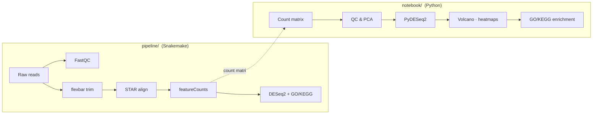

# RNA-Seq Analysis

An end-to-end RNA-Seq project: from **raw sequencing reads** to **differential
gene expression** and **functional enrichment**. It has two complementary parts —
a reproducible command-line pipeline that produces a count matrix, and an
interactive notebook that analyses it.



## Two parts

| Folder | What it is | Stack |
|--------|------------|-------|
| [`pipeline/`](pipeline/) | Reproducible **Snakemake** workflow: reads → QC → trimming → alignment → counts → DESeq2 → GO/KEGG. Each step in its own conda environment. | Snakemake, STAR, flexbar, featureCounts, R/DESeq2, clusterProfiler |
| [`notebook/`](notebook/) | Interactive **Jupyter** analysis of a count matrix: QC, PCA, differential expression, volcano/heatmaps, enrichment. Runnable end-to-end on the included dataset. | Python, PyDESeq2, gseapy, pandas, seaborn, scikit-learn |

The pipeline is the **upstream** half (it needs Linux command-line bioinformatics
tools); the notebook is the **downstream** half (it runs anywhere). Together they
cover the full workflow.

## Quickstart

**Pipeline** (Linux / WSL / macOS with conda):

```bash
cd pipeline
conda env create -f environment.yml && conda activate rnaseq
# add reference + reads to resources/ (see pipeline/resources/README.md), then:
snakemake --cores 4
```

**Notebook** (any platform):

```bash
cd notebook
pip install -r requirements.txt
jupyter lab notebooks/rnaseq_analysis.ipynb
```

See each folder's README for full details:
[`pipeline/README.md`](pipeline/README.md) · [`notebook/README.md`](notebook/README.md).

## Note on data

The notebook ships with a **simulated** count matrix (two conditions × three
replicates, with real human cell-cycle / interferon / apoptosis genes made
differentially expressed) so it runs without large reference files. It is clearly
labelled as simulated and is intended to demonstrate the analysis — not to
represent real experimental results. Drop in your own `counts.tsv` + metadata to
analyse real data.

## License

MIT — see [LICENSE](LICENSE).
